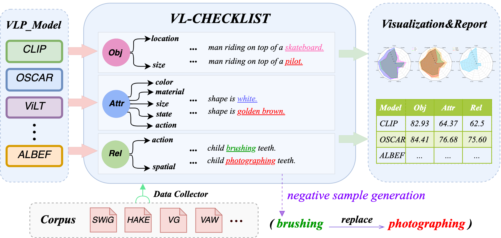

# VL-CheckList (Coming Soon)

 

## Updates
- 07/04/2022: VL-CheckList paper on arxiv https://arxiv.org/abs/2207.00221
- 07/12/2022: Updated object, relation, attribute splits/dataset
- 08/01/2022: Release the initial code and an example model

## Introduction
This repository is the official project page for (VL-CheckList). 
**VL-CheckList** is an explainable framework that comprehensively evaluates VLP models and facilitates deeper understanding.The current method to evaluate a VLP model is solely by comparing its fine-tuned downstream tasks performance, which has a number of limitations, such as poor interpretability, incomparable results and bias in data.


The core principle of VL-CheckList are: (1) evaluate a VLP model's fundamental capabilities instead of performance on applications (2) disentangle capabilities into relatively independent variables that are easier to analyze.

VL-CheckList evaluates VLP models from three aspects: Object, Attribute and Relationship. We provide the performance quantitative table and the radar chart based on the three aspects.

## How to Install VL-CheckList
There are two options to use VL-CheckList. First, you can install vl_checklist in your project and import vl_checklist and evaluate your models
```
pip install vl_checklist
```
Second, you can clone the project add your model engine which include 'predict' function. Please find an example engine [Link](./example_models/vilt/engine.py)
```
git clone https://github.com/om-ai-lab/VL-CheckList.git
```

## How to Evaluate your Model
We put the example models in the `example_models/` folder. 
**1.** Define a config file 
e.g. in [configs/sample.yam](./configs/sample.yaml)
```
MAX_NUM: 2000
MODEL_NAME: "ViLT"
BATCH_SIZE: 4
TASK: "itc"
DATA:
  TYPES: ["Attribute/color"]
  TEST_DATA: ["vg","vaw"]   
OUTPUT: 
  DIR: "output/vilt"
```
**2.** Prepare Evaluation Data
We provide the initial curated jsons at `data/` and corresponding yamls at `vl_checklist/corpus`. You can need to download image dataset. You can find the instruction in detail [Link](DATASETS.md)

**3.** Load the model which contain `predict()` and Evaluate class as follows.  
**4.** Run `start()` as follows

Here is an example code
```python
from example_models.vilt.engine import ViLT
from vl_checklist.evaluate import Evaluate

if __name__ == '__main__':
    model = ViLT('vilt_200k_mlm_itm.ckpt')
    vilt_eval = Evaluate(config="configs/sample.yaml", model=model)
    vilt_eval.start()
```    

 **5.**  check the results in the OUTDIR DIR you defined the yaml file
 You can check the output format [LINK](OUTPUT.md)

## Download Pretrained Weights
We include examples models at `example_models/`. You can download the pretrained weights at `resources/` folder to test our example models:
- [ViLT-B/32](https://github.com/dandelin/ViLT/releases/download/200k/vilt_200k_mlm_itm.ckpt)
- [ALBEF](https://storage.googleapis.com/sfr-pcl-data-research/ALBEF/ALBEF.pth)
- [TCL](https://drive.google.com/file/d/1Cb1azBdcdbm0pRMFs-tupKxILTCXlB4O/view)
- [UNITER](https://github.com/ChenRocks/UNITER)
- [OSCAR](https://biglmdiag.blob.core.windows.net/vinvl/model_ckpts/image_captioning/pretrained_base.zip)
- [LXMERT](https://drive.google.com/drive/folders/1Gq1uLUk6NdD0CcJOptXjxE6ssY5XAuat?usp=sharing)
- [CLIP](https://github.com/openai/CLIP)

## Demo
We present the demo in huggingface space, you can try it here: [Demo link](https://huggingface.co/spaces/omlab/VL_checklist_demo)  
In this demo, you can change the object and attribute of object in the text prompt. You can also change the size and location of the object.

## References
If you use any source codes or datasets included in this toolkit in your work, please cite the following paper. The bibtex are listed below:
```
@misc{https://doi.org/10.48550/arxiv.2207.00221,
  doi = {10.48550/ARXIV.2207.00221}, 
  url = {https://arxiv.org/abs/2207.00221},
  author = {Zhao, Tiancheng and Zhang, Tianqi and Zhu, Mingwei and Shen, Haozhan and Lee, Kyusong and Lu, Xiaopeng and Yin, Jianwei},
  keywords = {Computer Vision and Pattern Recognition (cs.CV), Computation and Language (cs.CL), Machine Learning (cs.LG), FOS: Computer and information sciences, FOS: Computer and information sciences},
  title = {VL-CheckList: Evaluating Pre-trained Vision-Language Models with Objects, Attributes and Relations},
  publisher = {arXiv},
  year = {2022},
  copyright = {Creative Commons Attribution 4.0 International}
}
```
